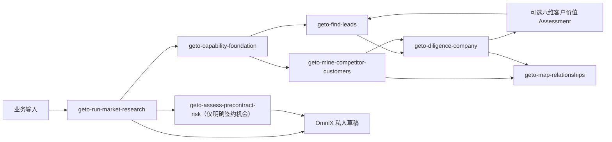

# GETO Overseas Outreach Skills

一组面向 GETO 海外市场调研、销售线索发现、公司背调、竞对客户反查、商业关系建模与签约前风险评估的模块化 Codex Skills。

业务交付以结构化 `ResearchDelta` 和 OmniX 私人草稿为目标，不依赖固定 Excel 工作表。所有关键判断保留 Claim/Source 证据链、自然键、研究状态与 provenance。

## Skills

| Skill | 职责 |
|---|---|
| `geto-capability-foundation` | 共享、只读的 GETO 产品、场景、ICP、案例与证据状态底座 |
| `geto-find-leads` | 多路发现、去重和管理候选池，聚合背调返回的六维 Assessment 并跨公司排序 |
| `geto-diligence-company` | 单一公司主体归一、深度背调、Claim/Source 证据补强，并可选生成六维客户价值 Assessment |
| `geto-mine-competitor-customers` | 发现并判定真实竞对，沿竞对官方案例反查未来客户 |
| `geto-map-relationships` | 建模公司、项目、产品、采购与合作关系 |
| `geto-assess-precontract-risk` | 对明确合作机会执行签约前主体、条款和项目经济风险评估 |
| `geto-run-market-research` | 编排以上模块，维护 ResearchRun、检查点、校验和私人草稿交付 |

## 模块关系



## Provider 边界

本仓库只包含 GETO 业务 Skills，不包含 Provider 或 OmniX REST 客户端实现。业务 Skills 动态使用当前环境中可用的 Provider：

- [OmniX Market Skill](https://github.com/Geto-distributor/omnix-market-skill)
- [OmniX Netease Waimao Skill](https://github.com/Geto-distributor/omnix-netease-waimao-skill)
- [TradeWind API Skill](https://github.com/liyichen7887/tradewind-global-trade-company-people-search)

公开 Web 研究是主要研究路径。TradeWind 和网易外贸通缺失时继续 Web-only，并显式记录覆盖缺口；OmniX Market 缺失时输出 API-ready ResearchDelta，但不声称已写入；GETO 能力底座缺失时可以继续中性发现和客观背调，但不能发布产品适配、竞对确认或正式客户价值总分。

## 安装

将需要的 `skills/<skill-name>/` 复制或链接到 Codex Skills 目录。完整国家市场调研通常使用 `geto-run-market-research`，并同时安装其余六个 GETO Skills。

每个 Skill 都包含：

- `SKILL.md`：触发条件与工作流。
- `agents/openai.yaml`：UI 元数据。
- `references/`：按需加载的合同、领域口径和证据规则。
- `scripts/`：需要确定性执行的校验或检查点工具，仅在相应 Skill 中提供。

## 本地验证

```bash
python -m pip install "PyYAML>=6,<7"
python scripts/validate_skills.py
python scripts/scan_secrets.py
python skills/geto-capability-foundation/scripts/validate_foundation.py
python skills/geto-run-market-research/scripts/validate_research_delta.py \
  skills/geto-run-market-research/references/examples/research-delta-available-empty.json
python -m unittest discover -s tests -v
```

CI 会遍历全部 Skills，校验 frontmatter、UI 元数据、相对引用、Python 语法、领域合同 smoke tests 和凭据模式。

## 安全与数据边界

- 不在仓库中保存 API Key、Cookie、RPA 凭据或用户研究数据。
- Provider 返回的数据先作为 `ExternalObservation`，完成主体归一与证据仲裁后才能进入 ResearchDelta。
- OmniX 写入仅进入当前用户私人草稿；提交审核必须是显式用户意图，Approve/Reject 只在 Web UI 完成。
- 不提交数据库 ID、SQL patch、Excel importer 或依赖固定 Sheet 名称的业务合同。

## License

Apache-2.0。详见 [LICENSE](LICENSE)。
